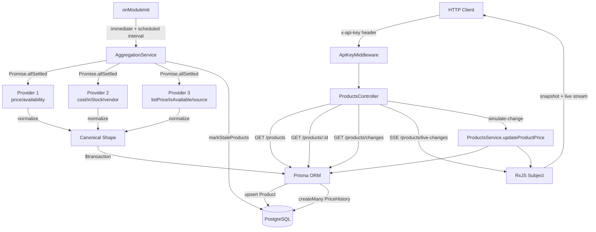

# 🗺️ System Map (SYSTEM_MAP.md)

This map reflects the actual directory structure and module wiring after Phase 1 completion.

---

## 📂 Directory Layout

```text
product-price-aggregator/
├── prisma/
│   ├── schema.prisma           # Product + PriceHistory models (isStale, availabilityChanged added)
│   └── migrations/             # 4 migrations: init, add_last_fetched, optimize_indexes, add_stale_avail
├── src/
│   ├── main.ts                 # Bootstrap — ValidationPipe, Swagger, static files
│   ├── app.module.ts           # Root module — wires ApiKeyMiddleware globally
│   ├── middleware/
│   │   └── api-key.middleware.ts   # x-api-key guard (SSE + /public bypass)
│   ├── aggregation/
│   │   ├── aggregation.module.ts
│   │   └── aggregation.service.ts  # Scheduler, fetch, normalize, upsert, stale marking
│   ├── products/
│   │   ├── dto/
│   │   │   ├── get-products.dto.ts
│   │   │   └── get-product-changes.dto.ts
│   │   ├── products.controller.ts  # SSE (merge snapshot+live), REST endpoints
│   │   ├── products.module.ts
│   │   └── products.service.ts     # RxJS Subject, getProductChanges (price+avail), updateProductPrice
│   ├── providers/
│   │   ├── providers.controller.ts # /mock-providers/provider1,2 debug routes
│   │   ├── providers.module.ts
│   │   ├── providers.service.ts    # 3 providers with different field schemas
│   │   ├── providers.service.spec.ts
│   │   └── providers.controller.spec.ts
│   └── modules/
│       └── prisma/
│           ├── prisma.module.ts
│           └── prisma.service.ts
├── public/
│   └── index.html              # SSE visualization page (plain HTML)
├── test/
│   └── app.e2e-spec.ts         # E2E: pagination, auth, 404, 400 validation
├── Dockerfile                  # Multi-stage build (builder + production)
├── docker-compose.yml          # Postgres + App services with health-check gate
├── .env                        # Local environment variables
├── package.json
├── tsconfig.json
└── nest-cli.json
```

---

## 🔄 Data & Execution Flow



---

## 🔑 Key Design Choices

| Decision | Rationale |
|---|---|
| `Promise.allSettled` | One provider failure doesn't abort the cycle |
| RxJS `Subject` for SSE | Direct Observable integration with `@Sse()` decorator |
| Middleware (not Guards) for auth | Global bypass rules without per-controller decorators |
| `isStale` flag (not delete) | Preserves history; consumers can filter `?isStale=false` |
| `availabilityChanged` in PriceHistory | Tracks both dimensions of change per assignment spec |
